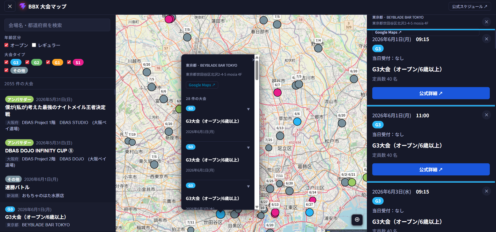

# BBX 大会マップ

ベイブレードXの大会スケジュールを地図上で可視化するWebアプリ。



## 機能

- **地図表示**: 日本全国の大会開催地をカラーピンで表示
- **年齢区分フィルター**: オープン / レギュラーを切り替え
- **大会タイプフィルター**: G3・G2・G1・S1・その他をグレード単位で絞り込み
- **テキスト検索**: 大会名・会場名・都道府県・住所でリアルタイム検索
- **詳細パネル**: ピンまたはリストをクリックで参加費・定員・参加資格・案内等を表示
  - 同座標に複数大会がある場合はまとめて一覧表示
  - フィルター変更に連動してパネル内容もリアルタイム更新
- **Google Maps連携**: 詳細パネルからそのまま地図アプリで開ける
- **キャッシュ**: ジオコーディング結果をlocalStorageに保存し、2回目以降は即時表示

## 技術スタック

| 役割 | 技術 |
|---|---|
| フレームワーク | React 18 + TypeScript |
| ビルド | Vite 6 |
| 地図 | Leaflet + react-leaflet + OpenStreetMap |
| ジオコーディング | 国土地理院 住所検索API |

## セットアップ

```bash
npm install
npm run dev      # 開発サーバー起動 (http://localhost:5173)
npm run build    # プロダクションビルド
npm run preview  # ビルド結果のプレビュー
```

## データソース

### 大会データ

公式APIからページ読み込み時に1回だけ取得する。

```
GET https://beyblade.takaratomy.co.jp/beyblade-x/shop_event/event_manage/public/api/open_all_event
```

レスポンス形式（抜粋）:

```json
{
  "state": "success",
  "events": [
    {
      "id": 48063,
      "event_type_open_name": "S1イベント",
      "event_shubetsu": "G2",
      "name": "S1イベント㊿",
      "start_date": "2026-05-31 06:00",
      "shop_name": "トイザらス 〇〇店",
      "place_name": "出部公民館",
      "place_address": "岡山県井原市上出部町1219-2",
      "place_address1": "岡山県",
      "address1": "岡山県",
      "address2": "井原市上出部町1219-2",
      "price": "無料",
      "capacity": 128,
      "shikaku": "6歳以上だれでもOK",
      "uketsuke": 1
    }
  ]
}
```

### 住所解決

`resolveAddress()`（`utils/address.ts`）が以下の優先順位で住所文字列を決定する:

1. `place_address` がある場合はそれを使用（都道府県名の二重化を自動補正）
2. ない場合は `address1` + `address2` を結合
3. `address2` が都道府県名から始まっていれば `address2` のみ使用

### ジオコーディング

APIレスポンスに座標は含まれないため、[国土地理院 住所検索API](https://msearch.gsi.go.jp/address-search/AddressSearch) で住所→緯度経度に変換する。

- CORSに対応しており、ブラウザから直接呼び出し可能
- 5件並列でバッチ処理（200ms間隔）
- 取得結果は `localStorage` にキャッシュ（キー: `bbx_geocode_cache_v2`）
- 座標が取得できなかったイベントはマップから除外

## フィルター仕様

フィルターはマップ・左サイドバーのリスト・右の詳細パネルの3箇所すべてに同時適用される。

### 年齢区分 (`AgeCategory`)

`keishiki` / `event_shubetsu` / `event_type_open_name` / `event_type_name` のいずれかに
"レギュラー" または "regular" が含まれれば `regular`、それ以外は `open`。

| 値 | ラベル |
|---|---|
| `open` | オープン |
| `regular` | レギュラー |

### 大会タイプ (`TournamentGrade`)

`event_shubetsu` / `event_type_open_name` / `event_type_name` から G1〜G3・S1 を検出する。

| 値 | ラベル | ピン色 |
|---|---|---|
| `G3` | G3 | 水色 |
| `G2` | G2 | 緑 |
| `G1` | G1 | 琥珀 |
| `S1` | S1 | マゼンタ |
| `other` | その他 | グレー |

アンバサダー・エクストリームカップ等の特殊タイプは `other` グレードとして扱い、
ピン色のみ `EventType` ベースの別色（黄緑・紫など）でオーバーライドされる。

## イベント種別 (`EventType`)

フィルター軸ではなく、バッジ表示・ピン色のオーバーライドに使用する。

| 種別 | APIの `event_type_open_name` |
|---|---|
| `b4store` | `B4大会` / `B4イベント` |
| `s1` | `S1大会` / `S1イベント` |
| `ambassador` | `アンバサダーイベント` |
| `extreme-cup` | `エクストリームカップ` |
| `casual-battle` | `カジュアルバトルデイ` / `CASUAL BATTLE DAY` |
| `tour` | `出張イベント` |
| `fan` | `ファン主催イベント` |
| `other` | 上記以外 |

## ディレクトリ構成

```
src/
├── api/
│   └── events.ts        # 公式API fetch
├── components/
│   ├── EventCard.tsx    # リスト内の1件カード
│   ├── EventDetail.tsx  # 詳細パネルの1件表示
│   ├── EventList.tsx    # サイドバーのリスト
│   ├── FilterBar.tsx    # 年齢区分・大会タイプフィルター＋検索
│   └── MapView.tsx      # Leaflet地図・CircleMarker
├── types/
│   └── index.ts         # TournamentEvent・ApiEvent 型定義・マッピング関数
├── utils/
│   ├── address.ts       # 住所解決・都道府県名正規化
│   ├── date.ts          # 日付フォーマット
│   └── geocode.ts       # 国土地理院ジオコーディング + キャッシュ
├── App.tsx              # 状態管理・レイアウト
├── index.css            # デザイントークン・スタイル
└── main.tsx             # エントリーポイント
public/
├── favicon.svg          # アプリアイコン（ヘッダーにも使用）
└── icons.svg            # マップピン用SVGスプライト
```

## 参考

- [デザイン参考: LBE Map](https://webar.styly.cc/landing_pages/lbe-map)
- [公式スケジュールページ](https://beyblade.takaratomy.co.jp/beyblade-x/event/schedule.html#schedule)
